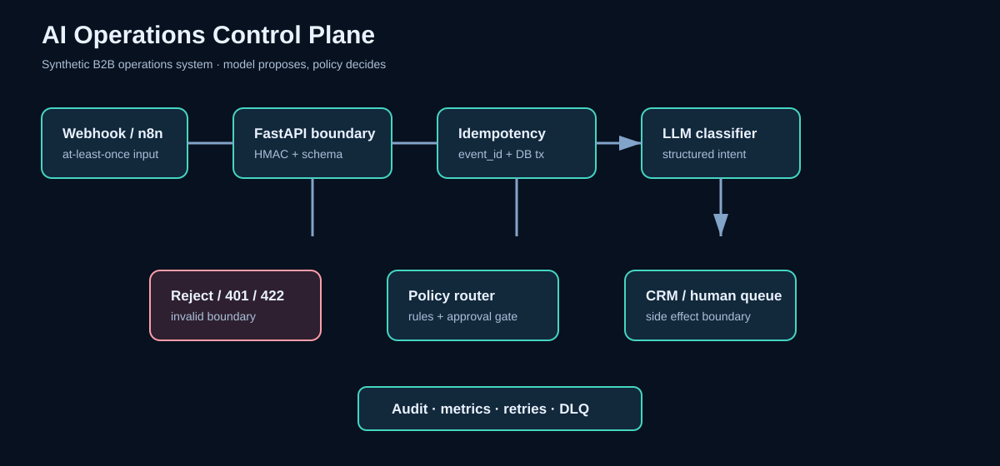

# AI Operations Control Plane

**Synthetic, production-minded B2B operations orchestration reference implementation by Berk Erkuş.**

> A CTO should be able to inspect the boundaries, replay failures, and understand what happens when the model, CRM, network, or human reviewer is unavailable. This project is designed for that review—not as a tutorial and not as a claim of customer results.

## 60-second view

`Webhook → authenticated FastAPI boundary → schema validation → idempotency → structured LLM classification → deterministic policy → CRM sync OR human approval → audit/dead-letter → metrics/realtime status`



- **Live demo:** https://berknerkus-commits.github.io/berk-ai-operations-control-plane/
- **API docs:** `/docs` when running locally
- **n8n export:** [`n8n/ai-ops-control-plane.json`](n8n/ai-ops-control-plane.json)

## Engineering decisions

1. **The model proposes; policy decides.** The classifier is constrained to a small intent schema. High-impact and uncertain cases require a human approval queue.
2. **At-least-once delivery is assumed.** `event_id` is the idempotency boundary. Replays return the existing decision instead of creating another decision or CRM side effect.
3. **Every failure has a destination.** Invalid input is rejected at the boundary; transient downstream failures retry with backoff; exhausted work belongs in a dead-letter queue; each transition is audited.
4. **Security is explicit.** HMAC webhook verification, correlation IDs, bounded payloads, parameterized persistence and secret-by-environment configuration are shown. Production needs key rotation, replay windows, rate limits and a managed secret store.
5. **Local and deployed paths are separated.** Tests use SQLite for fast deterministic verification; Compose provisions PostgreSQL, n8n and the API for deployment-shaped review. The SQL schema is the production persistence contract.

## Run

```bash
python3 -m venv .venv && .venv/bin/pip install -r requirements.txt
.venv/bin/pytest -q
# API (optional): .venv/bin/uvicorn app:api --reload
# Deployment-shaped stack: POSTGRES_PASSWORD='local-only' WEBHOOK_SECRET='local-only' docker compose -f infra/docker-compose.yml up --build
```

Example payload:

```json
{"event_id":"evt-100","account_id":"acct-7","email":"buyer@example.com","message":"Please send a quote","source":"partner-webhook","amount":1200}
```

Endpoints: `GET /health`, `GET /ops/metrics`, `POST /v1/webhooks/operations`, `WS /ws/ops`. FastAPI generates OpenAPI/Swagger at `/docs`.

## Verification

- Unit tests: validation, HMAC boundary, intent schema, policy branching and idempotency.
- Integration-shaped tests: persistence and audit/approval state transitions.
- Failure tests: transient retry/backoff and dead-letter recording.
- CI: GitHub Actions runs tests, compile checks and Compose configuration validation.
- Synthetic benchmark: `python benchmarks/throughput.py` measures local in-memory dispatch only; it is not a production capacity claim.

## Demo walkthrough (90–120 seconds)

1. Open `/docs`; show the authenticated webhook contract and the metrics endpoint.
2. Send a synthetic sales event; show the deterministic `sync_crm` decision and audit count.
3. Replay the same `event_id` with a different message; show that the original decision is returned and duplicate count increments.
4. Send a billing or uncertain event; show `queue_human_review` and the pending approval count.
5. Send an invalid signature and malformed payload; show 401/422 boundaries.
6. Run the failure test; show three bounded attempts and dead-letter recording.
7. Open `n8n/ai-ops-control-plane.json` and the deployment diagram to show how this maps into an agency workflow.

## Production next steps and limits

- Replace SQLite adapter with the included PostgreSQL schema and transaction/locking strategy.
- Add provider-specific structured-output validation, prompt/version registry, redaction and model-evaluation gates.
- Add authentication/authorization for operators, approval UI, CRM connector contracts, webhook replay windows, rate limiting and secret rotation.
- Add OpenTelemetry traces, Prometheus scraping and alert rules; the current `/ops/metrics`, audit records and JSON logs are the intentionally small observability seam.
- Run migrations, backups, restore drills, load tests and dependency/image scanning in the target environment.

No customer data, employer data, credentials, fake testimonials, customer metrics or revenue claims are included. All fixtures and benchmark inputs are synthetic.
